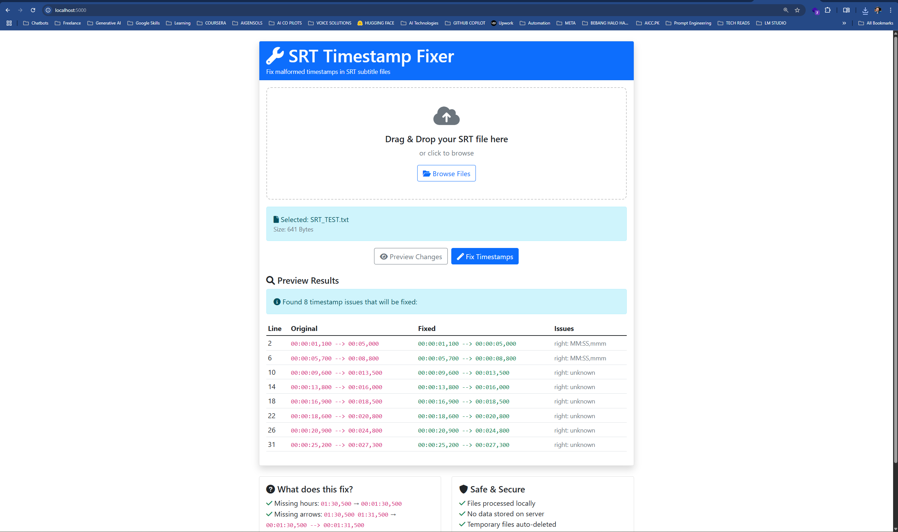

# SRT Timestamp Fixer

A lightweight, standalone toolkit for fixing malformed SRT subtitle timestamps. Available as Command Line Interface (CLI), Desktop GUI, Web Application, and Windows Executables (.exe).

---

## 🚀 Overview
SRT Timestamp Fixer standardizes SRT subtitle files by fixing malformed timestamps, missing arrows, and formatting issues. Designed for content creators, video editors, and anyone working with AI-generated or automated subtitles.

## ✨ Features
- Fix missing hours in timestamps
- Add missing arrows
- Standardize SRT format
- Multiple interfaces: CLI, GUI, Web, Windows Executable (.exe)
- Safe processing (backups, UTF-8)
- Cross-platform (Python 3.6+)

---

## ⚡ Quick Start

### 1. Command Line
```bash
python src/convert_to_srt.py -i input.srt -o output.srt
```

---

### 2. Desktop GUI
**Windows:** Double-click `SRT_Timestamp_Fixer_GUI.exe` or `src/launch_gui.bat`  
**Linux/macOS:** Run `src/launch_gui.sh`

<div align="center">
  
  <br>
  <strong>Desktop GUI:</strong> Easily fix SRT files with a user-friendly interface. Select files, preview changes, and process with a click.
</div>

---

### 3. Web Application
**Windows:** Double-click `SRT_Timestamp_Fixer_Web.exe` or `src/launch_web.bat`  
**Linux/macOS:** Run `src/launch_web.sh`  
Open browser at `http://localhost:5000`

<div align="center">
  
  <br>
  <strong>Web App:</strong> Fix SRT files directly in your browser. Upload, preview, and download results. Works on any OS.
</div>

For more details and troubleshooting, see [USER_GUIDE.md](USER_GUIDE.md).

---

## 🛠️ Development & Build

1. Clone the repository:
   ```bash
   git clone https://github.com/[YOUR-USERNAME]/srt-timestamp-fixer.git
   cd srt-timestamp-fixer
   ```
2. (Optional) Create a virtual environment:
   ```bash
   python -m venv venv
   # Windows:
   venv\Scripts\activate
   # Linux/macOS:
   source venv/bin/activate
   ```
3. Install dependencies:
   ```bash
   pip install -r src/requirements.txt
   ```
4. Run the web app:
   ```bash
   python src/srt_fixer_web.py
   ```

### Build Executable (Windows)
```bash
pip install pyinstaller
pyinstaller --onefile --windowed src/srt_fixer_web.py
```

---

## 🤝 Contributing
See [USER_GUIDE.md](USER_GUIDE.md) for usage details and troubleshooting.

To contribute:
1. Fork the repository
2. Create a feature branch
3. Commit and push your changes
4. Open a Pull Request

## 📄 License
MIT License. See [LICENSE](LICENSE).
